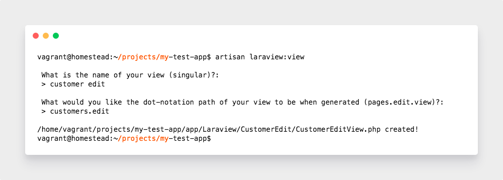
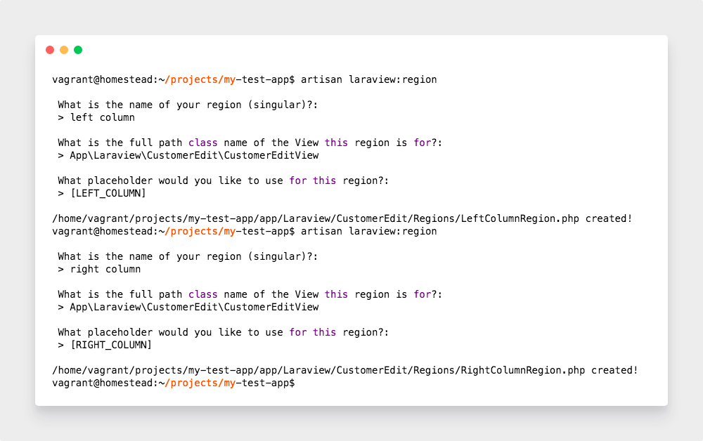
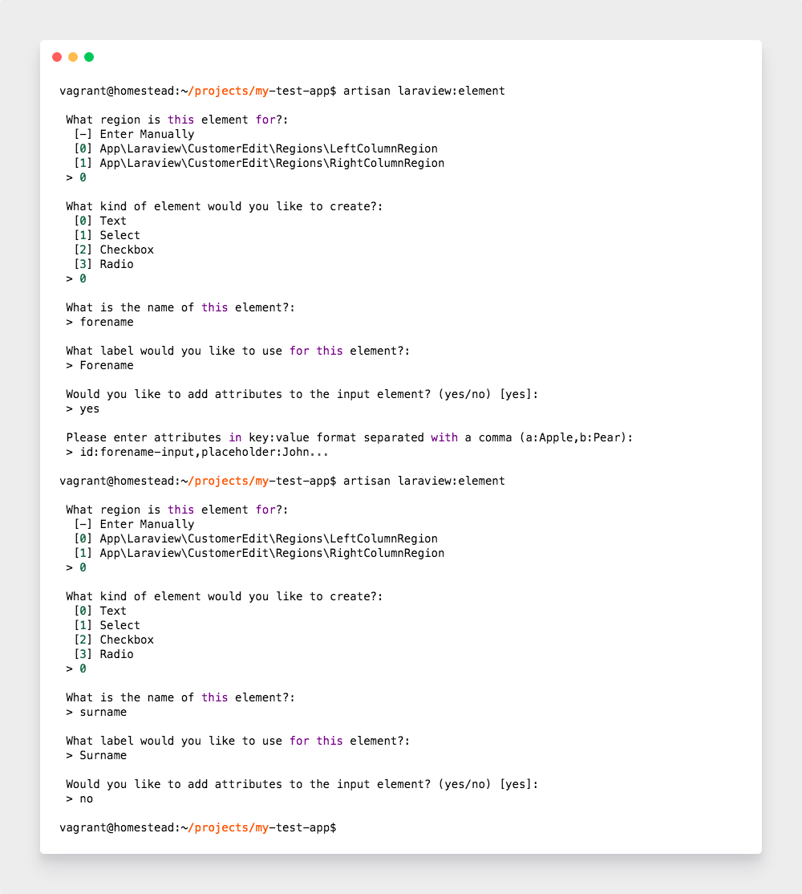
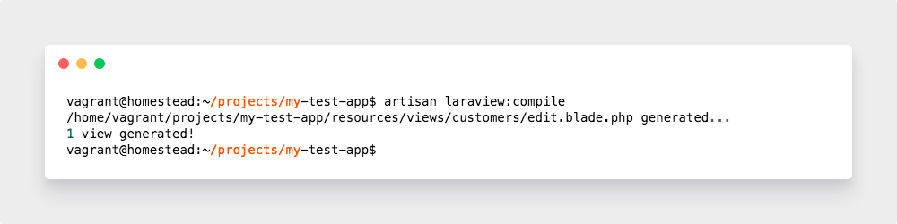

# Laraview

## Installation

You can install the package via Composer:

```
composer require lukesnowden/laraview
````

Next, you must install the service provider to `config/app.php`:

```php
'providers' => [
    // ...
    Laraview\Providers\AppServiceProvider::class
];
```

And finally run the following command to generate your view files

```cli
php artisan laraview:compile
```

## Demo

A demo can be found at https://github.com/lukesnowden/customer-views. Just pull the package down, include the service provider and compile the views.

## Walk-through

I'd like to provide a walk-through to demonstrate how this package can be used in a production application.

Lets imagine we have an admin panel which has a users section where you can edit a user's details. Lets 
create that View: 

### View Generator

```cli
php artisan laraview:view
```



The `View` stub has now been created and located in `app/Laraview/CustomerEdit/`. We can now register 
this `View`, I suggest creating a new service provider to keep things clean:

```cli
php artisan make:provider ViewServiceProvider
```

Add this new provider to the `config/app.php`.

In the boot method of the View service provider register the new `View` using the `Register` object;

```php
<?php

namespace App\Providers;

use App\Laraview\CustomerEdit\CustomerEditView;
use Illuminate\Support\ServiceProvider;
use Laraview\Libs\Blueprints\RegisterBlueprint;

class ViewServiceProvider extends ServiceProvider
{
    /**
     * Bootstrap services.
     *
     * @return void
     */
    public function boot()
    {
        $this->app->booted( function( $app ) {
            $app[ RegisterBlueprint::class ]->attachView( new CustomerEditView );
        });
    }

}
``` 

Along with the stub 
a `template.blade.php` has been created which is used to structure your `Regions`. Lets alter it 
slightly to incorporate two regions, `Left Column` and `Right Column`. We can define these using 
`Placeholders`:

```blade
@extends( 'app' )

@section( 'main' )
    <div class="container">
        <div class="row">
            <div class="left-column col-8">
                [LEFT_COLUMN]
            </div>
            <div class="right-column col-4">
                [RIGHT_COLUMN]
            </div>
        </div>
    </div>
@endsection
``` 

### Region Generator

Now we have the view setup lets create two new `Regions`, `LEFT_COLUMN` and `RIGHT_COLUMN`;

```cli
php artisan laraview:region
```



Now you will have two more files generated in `app/Laraview/CustomerEdit/Regions`. Lets register 
these regions onto our `View`.

```php
<?php

namespace App\Laraview\CustomerEdit;

use App\Laraview\CustomerEdit\Regions\LeftColumnRegion;
use App\Laraview\CustomerEdit\Regions\RightColumnRegion;
use Laraview\Libs\Blueprints\ViewBlueprint;
use Laraview\Libs\BaseView;

class CustomerEditView extends BaseView implements ViewBlueprint
{

    /**
     * @var string
     */
    protected $path = 'customers.edit';

    /**
     * @var string
     */
    protected $baseViewPath = 'template.blade.php';

    /**
     * Regions to attach to this view
     * @var array
     */
    protected $regions = [
        LeftColumnRegion::class,
        RightColumnRegion::class
    ];

}
```

### Element Generator

```cli
php artisan laraview:element
```

Lets now add a couple of input elements to the `Left Column`, forename and surname.



Lets now register these `Elements` to the `Region`.

```php
<?php

namespace App\Laraview\CustomerEdit\Regions;

use App\Laraview\CustomerEdit\Regions\LeftColum\Elements\ForenameTextElement;
use App\Laraview\CustomerEdit\Regions\LeftColum\Elements\SurnameTextElement;
use Laraview\Libs\Blueprints\RegionBlueprint;
use Laraview\Libs\BaseRegion;

class LeftColumnRegion extends BaseRegion implements RegionBlueprint
{

    /**
     * @var string
     */
    protected $placeholder = '[LEFT_COLUMN]';

    /**
     * @var array
     */
    protected $elements = [
        ForenameTextElement::class,
        SurnameTextElement::class
    ];

}
```

Now all we need to do is compile everything down into the blade file.



If you now open up the generated file you should see this;

```blade
@extends( 'app' ) 
@section( 'main' )
<div class="container">
	<div class="left-column col-8">
		<div class="form-group">
			<label for="forename-input">Forename</label>
			<input name="forename" id="forename-input" placeholder="John..." class="form-control" value="{{ old('forename') }}" />
		</div>
		<div class="form-group">
			<label for="surname">Surname</label>
			<input name="surname" id="surname" class="form-control" value="{{ old('surname') }}" />
		</div>
	</div>
	<div class="right-column col-4">
	</div>
</div>
@endsection
```

## Hooking into foreign regions 

If like us, you like to split your applications up into modules, sometimes a module 
will intrude onto one and others regions.

For instance, creating a module for `Google Shopping Feed`, we would like to add 
a checkbox and drop down onto the product edit view to indicated that said product
is to be added and to which Google Shopping category.

We can do this by listening to when the region is attached and then inserting our 
elements using the `insertElement`, `insertElementBefore` or `insertElementAfter` methods.

## MIT License

Copyright (c) 2018 Luke Snowden

Permission is hereby granted, free of charge, to any person obtaining a copy
of this software and associated documentation files (the "Software"), to deal
in the Software without restriction, including without limitation the rights
to use, copy, modify, merge, publish, distribute, sublicense, and/or sell
copies of the Software, and to permit persons to whom the Software is
furnished to do so, subject to the following conditions:

The above copyright notice and this permission notice shall be included in all
copies or substantial portions of the Software.

THE SOFTWARE IS PROVIDED "AS IS", WITHOUT WARRANTY OF ANY KIND, EXPRESS OR
IMPLIED, INCLUDING BUT NOT LIMITED TO THE WARRANTIES OF MERCHANTABILITY,
FITNESS FOR A PARTICULAR PURPOSE AND NONINFRINGEMENT. IN NO EVENT SHALL THE
AUTHORS OR COPYRIGHT HOLDERS BE LIABLE FOR ANY CLAIM, DAMAGES OR OTHER
LIABILITY, WHETHER IN AN ACTION OF CONTRACT, TORT OR OTHERWISE, ARISING FROM,
OUT OF OR IN CONNECTION WITH THE SOFTWARE OR THE USE OR OTHER DEALINGS IN THE
SOFTWARE.
