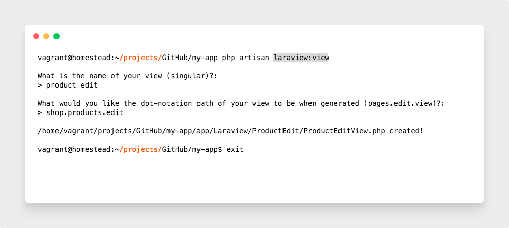

# Laraview

## Installation

You can install the package via Composer:

```
composer require lukesnowden/laraview
````

Next, you must install the service provider to `config/app.php`:

```php
'providers' => [
    // ...
    Laraview\Providers\AppServiceProvider::class,
    // Laraview\Providers\DemoServiceProvider::class
];
```

Uncomment the demo service provider to run a demo test.

And finally run the following command to generate your view files

```cli
php artisan laraview:compile
```

## View Generator

```cli
php artisan laraview:view
```

coming soon...

## Region Generator

```cli
php artisan laraview:region
```



coming soon...

## Element Generator

```cli
php artisan laraview:element
```

coming soon...

I would now suggest creating a new service provider to register your new view;

```cli
php artisan make:provider ViewServiceProvider
```

Once created, register your new view in the `boot` method inside a `booted` closure like so;

```php
<?php

namespace MyApp\Providers;

use Illuminate\Support\ServiceProvider;
use Laraview\Libs\Blueprints\RegisterBlueprint;
use MyApp\Laraview\ProductEdit\ProductEditView;

class ViewServiceProvider extends ServiceProvider
{
    /**
     * Bootstrap services.
     *
     * @return void
     */
    public function boot()
    {
        $this->app->booted( function( $app ) {
            $app[ RegisterBlueprint::class ]->attachView( new ProductEditView );
        });
    }
}
```

## Hooking into foreign regions 

If like us, you like to split your applications up into modules, sometimes a module 
will intrude onto one and others regions.

For instance, creating a module for `Google Shopping Feed`, we would like to add 
a checkbox and drop down onto the product edit view to indicated that said product
is to be added and to which Google Shopping category.

We can do this by listening to when the region is attached and then insert our 
elements using the regions `insertElement` method. Very soon, there will also 
be an `insertElementBefore` and `insertElementAfter` methods available.

```php
<?php

namespace MyApp\Providers;

use Illuminate\Support\ServiceProvider;
use Laraview\Libs\Blueprints\RegisterBlueprint;
use MyApp\Laraview\ProductEdit\ProductEditView;

class ViewServiceProvider extends ServiceProvider
{
    /**
     * Bootstrap services.
     *
     * @return void
     */
    public function boot()
    {
        $this->app->booted( function( $app ) {
            $app[ RegisterBlueprint::class ]->attachView( new ProductEditView );
        });
        app( 'events' )->listen( LeftHandColumn::class . '.attached', function( $region ) {
            $region->insertElement( GoogleCheckoutCheckboxElement::class );
            $region->insertElement( GoogleCheckoutSelectElement::class );
        });
    }
}
```


## MIT License

Copyright (c) 2018 Luke Snowden

Permission is hereby granted, free of charge, to any person obtaining a copy
of this software and associated documentation files (the "Software"), to deal
in the Software without restriction, including without limitation the rights
to use, copy, modify, merge, publish, distribute, sublicense, and/or sell
copies of the Software, and to permit persons to whom the Software is
furnished to do so, subject to the following conditions:

The above copyright notice and this permission notice shall be included in all
copies or substantial portions of the Software.

THE SOFTWARE IS PROVIDED "AS IS", WITHOUT WARRANTY OF ANY KIND, EXPRESS OR
IMPLIED, INCLUDING BUT NOT LIMITED TO THE WARRANTIES OF MERCHANTABILITY,
FITNESS FOR A PARTICULAR PURPOSE AND NONINFRINGEMENT. IN NO EVENT SHALL THE
AUTHORS OR COPYRIGHT HOLDERS BE LIABLE FOR ANY CLAIM, DAMAGES OR OTHER
LIABILITY, WHETHER IN AN ACTION OF CONTRACT, TORT OR OTHERWISE, ARISING FROM,
OUT OF OR IN CONNECTION WITH THE SOFTWARE OR THE USE OR OTHER DEALINGS IN THE
SOFTWARE.
